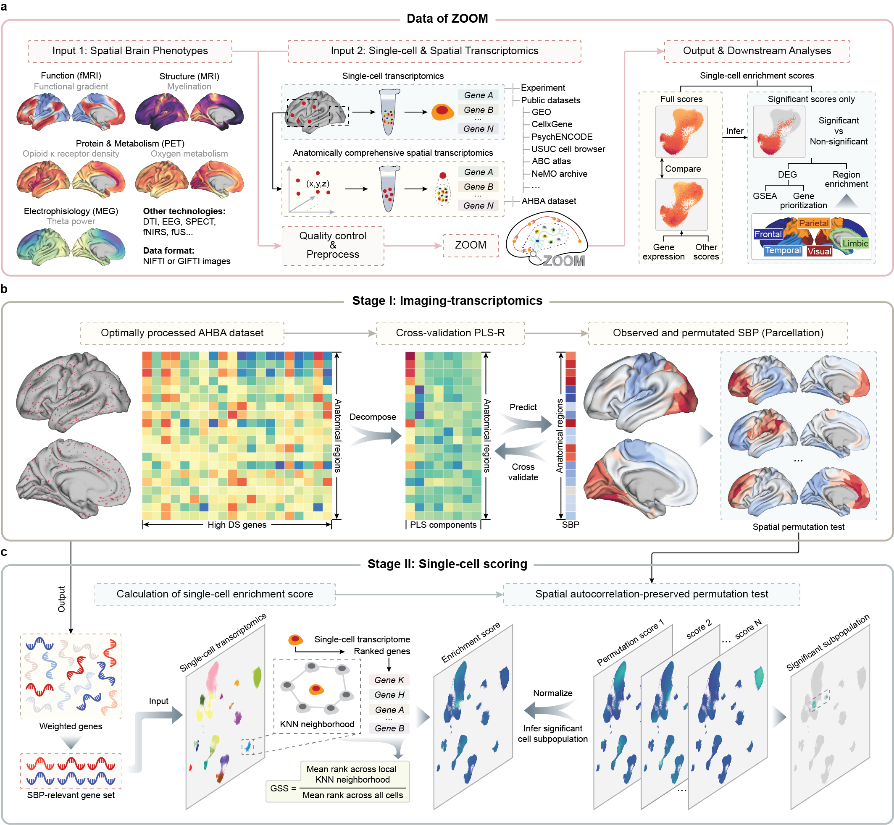

# ZOOM

## Decoding molecular and cellular underpinnings of macroscopic spatial brain phenotypes with ZOOM
ZOOM is a Python-based integrative framework for linking macroscopic and mesoscopic spatial brain phenotypes (SBPs) with microscopic molecular, cellular information.

 

Customed analysis code used in this study can be found [here](paper).

## Tutorial
Installation and guidance of ZOOM can be found here.
