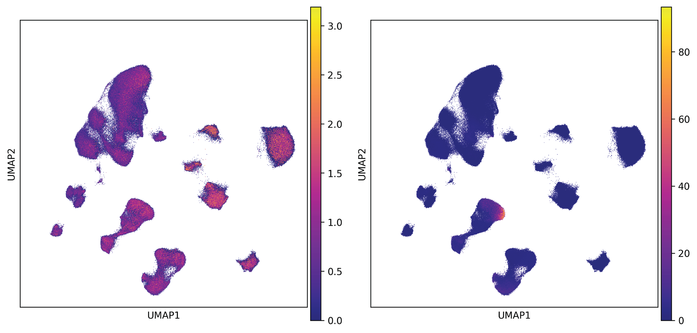

.. _usage_prepare:

Prepare input data
==================

.. _usage_ahba:

The Allen Human Brain Atlas dataset
-----------------------------------

Spatial alignment of spatial brain phenotypes (SBPs) with transcriptomic data requires downloading and 
preprocessing the anatomically comprehensive AHBA dataset. The preprocessing pipeline implemented in 
``zoom``, adapted from `Dear, R. et al. <https://www.nature.com/articles/s41593-024-01624-4>`_, is 
optimized for cortical samples. For whole-brain or subcortical analyses, alternative toolkits such as 
``abagen`` are recommended to enable customized AHBA preprocessing. To improve the accuracy of spatial 
registration in the AHBA dataset, we recommend using `donor-specific parcellation images <https://figshare.
com/articles/dataset/AHBAdata/6852911>`_. ``zoom`` also provides an interface for rapid access to these 
parcellation images. You can prepare parcellated AHBA data into HCP-MMP1.0 atlas with the following Python 
codes:

.. code-block:: python

    >>> import zoom.prepare as pp
    >>> atlas_hcp = pp.fetch_atlas(atlas="HCP-MMP")
    >>> hcp_expr, hcp_ds = pp.abagen_ctx(
            atlas=atlas_hcp["image"],
            atlas_info=atlas_hcp["info"],
            data_dir="/path/to/ahba/microarray",
            donors_threshold=3, 
            gene_stability_threshold=0.5
        )
    >>> hcp_expr
               A1BG  A1BG-AS1      AAAS  ...       ZYX     ZZEF1      ZZZ3
    label
    1      0.234124  0.260771  0.686152  ...  0.839740  0.825577  0.346719
    4      0.363618  0.284738  0.681523  ...  0.810666  0.738654  0.357823
    5      0.219162  0.217884  0.648171  ...  0.784044  0.761205  0.309604
    ...         ...       ...       ...  ...       ...       ...       ...
    177    0.691370  0.711700  0.493273  ...  0.472524  0.369499  0.538924
    178    0.860420  0.640386  0.465522  ...  0.335314  0.422038  0.589355
    179    0.602025  0.630528  0.536149  ...  0.341723  0.425138  0.658279
    [137 rows x  7973 columns]

Execution of the :func:`zoom.prepare.abagen_ctx` function requires the additional installation of the ``abagen``
package, which can be found `here <https://abagen.readthedocs.io/en/stable/index.html>`_. The path ``/path/to/ahba
/microarray`` may either be pre-downloaded by the user from the `AHBA website <http://human.brain-map.org>`_ or 
fetched directly via ``abagen``. Additionally, apart from donor-specific parcellation images, any ``atlas`` and 
corresponding ``atlas_info`` compatible with ``abagen`` are likewise supported by above function. In addition to 
AHBA gene expression profile, this code also returns gene-level differential stability (DS), an indicator that 
quantifies the consistency of spatial distribution across genes, which will be used in subsequent analyses.

Arguments to :func:`zoom.prepare.abagen_ctx`
++++++++++++++++++++++++++++++++++++++++++++

.. class:: donors_threshold int, default 3

  Minimum number of donors required for a region to be included.

.. class:: gene_stability_threshold float, default 0.5
  
  Threshold for filtering genes based on differential stability across donors.

.. _usage_sbp:

The spatial brain phenotype data
--------------------------------

On the other hand, we also need to map the SBP data onto the parcellation image that corresponds to the brain space in 
which the SBP data are defined (That's HCP-MMP1.0 atlas in fsLR 32k space in this analysis). In addition, to account 
for spatial autocorrelation in subsequent analyses, ``zoom`` implements `Alexander‑Bloch’s spatial permutation model 
<https://www.sciencedirect.com/science/article/pii/S1053811918304968>`_ via ``neuromaps``. Once the parameters are 
specified, the following code will automatically perform these steps:

.. code-block:: python
    
    >>> import zoom.prepare as pp
    >>> SBP, SBP_perm = pp.process_SBP(
            SBP="/path/to/lh.FG2.fsLR.32k.func.gii",
            parcellation="path/to/lh.HCPMMP1.fsLR.32k.label.gii",
            atlas="fsLR", density="32k", hemi="L", 
            n_perm=1000, seed=123
        )

Likewise, execution of the :func:`zoom.prepare.process_SBP` function requires the additional installation of the 
``neuromaps`` package, which can be found `here <https://netneurolab.github.io/neuromaps/index.html>`_. Of note, 
In the original implementation of Alexander‑Bloch’s spatial permutation model in ``neuromaps``, the medial wall 
is not removed beforehand. However, the medial wall lacks clear biological interpretability in surface‑based neuroimaging 
and its inclusion may introduce ``NaN`` values. Therefore, we explicitly exclude medial wall values in the development 
of the above function. And now we can plot the processed SBP data via ``wb_view``, which can be found `here <https://www.
humanconnectome.org/software/connectome-workbench>`_.

.. figure::  images/FG2_HCPMMP.png
   :align:   center
   :width: 70%

   Parcellated seneorimotor-to-visual gradient map

.. figure::  images/FG2_HCPMMP_spined.png
   :align:   center

   Randomly permutated seneorimotor-to-visual gradient maps

.. note:: 
    So far, ``zoom`` only supports the automated processing of surface‑based images. For volume‑based images, we recommend 
    using ``brainsmash`` to implement the parameterized spatial permutation model, which can be found `here <https://brainsmash.
    readthedocs.io/en/latest/index.html>`_.

.. _usage_sc:

The single-cell RNA sequencing data
-----------------------------------

The core functionality of ``zoom`` is to compute enrichment scores for SBP‑relevant gene sets at the single‑cell level. 
To achieve this, we require a human brain single‑cell RNA sequencing (scRNA-seq) dataset. Here, we use the `integrated 
scRNA‑seq dataset of the adult cortex collected by Nano, P. R. et al. <https://adult-ctx-meta-atlas.cells.ucsc.edu>`_, 
which we have re‑integrated and re‑annotated. We then visualize the cell type annotation using ``scanpy``:

.. code-block:: python

    >>> import scanpy as sc
    >>> adata = sc.read_h5ad("/path/to/integrated.adult_ctx.h5ad")
    >>> sc.pl.embedding(
            adata,
            basis='umap',
            color='Cluster',
            title='',
            show=False
        )

.. figure::  images/umap.png
   :align:   center

   UMAP plot of scRNA-seq dataset, colored by cell type annotation

Next, to mitigate errors introduced by technical noise and biological replicates in the raw gene expression matrix, 
while highlighting genes of particular relevance to specific cell subpopulations, we computed the `rank‑based Gene 
Specificity Score (GSS) proposed by Song, L. et al. <https://www.nature.com/articles/s41586-025-08757-x>`_ in 
``gsMap``, based on which single‑cell enrichment scores will be calculated. Users can calculate the GSS for scRNA‑seq 
datasets using the following code:

.. code-block:: python

    >>> from zoom import sc_tool as sct
    >>> adata = sct.compute_gss(
            adata,
            d=50,
            n_jobs=-1 # use parallel computation
        )

.. note:: 
    Since :func:`zoom.sc_tool.compute_gss` iterates over individual cells, it can be very time‑consuming for large 
    datasets despite parallelization. For reference, processing 500,000 cells on 48 cores takes approximately 12 
    hours. Please be patient. And we recommend saving the resulting ``AnnData`` object from this step to a new 
    ``.h5ad`` file.

The above code will add a ``gss`` entry to ``adata.layers``. Taking *HRH3* as an example, *HRH3* is broadly expressed 
across various cell types in the human cortex. However, the GSS indicates that *HRH3* is most critical for a small 
subset of VIP interneurons, as illustrated below:

   UMAP plot of normalized expression (left) and GSS (right) of *HRH3*

Arguments to :func:`zoom.sc_tool.compute_gss`
+++++++++++++++++++++++++++++++++++++++++++++

.. class:: d int, default 50

  Number of nearest neighbors for each cell, based on which GSS will be calculated.

.. class:: gss_limit float, default 200.0
  
  Allowed maximum GSS value to avoid over-representation.

The files produced by the three steps above will serve as inputs to the main class in ``zoom`` to associate SBPs with 
the scRNA‑seq dataset, which will be described in the following sections.