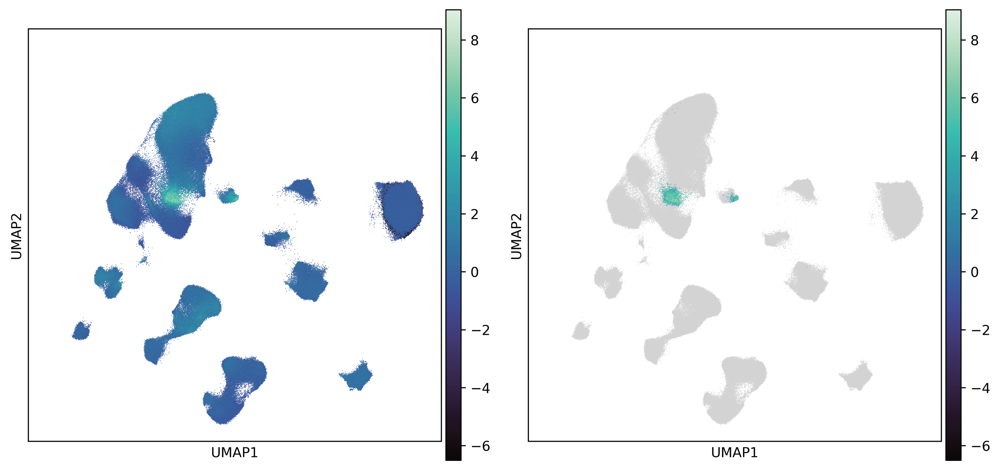

.. _usage_sc_score:

Single-cell enrichment score of SBP-relevant gene set
=====================================================

.. _usage_score:

Single-cell scoring
-------------------

We next aim to test whether SBP‑relevant gene sets show enriched expression in specific cell 
subpopulations. ``zoom`` adapted the `scDRS method proposed Zhang, M. J. et. al. <https://www.nature.
com/articles/s41588-022-01167-z>`_, selecting control gene sets based on permuted SBPs to mitigate 
spatial autocorrelation–driven false positives, and incorporating gene DS and specificity scores
to reduce technical noise and inter‑individual variability while emphasizing genes with specific, 
stable expression patterns. Here we use the negative direction of the sensorimotor–to–visual gradient 
(SVG-) as an example:

.. code-block:: python

    >>> zoom_obj.get_SBP_score(
            direction=False,
            gene_size=35,
            fdr_method="group_bh",
            alpha=0.1,
            group="Subcluster",
            min_score=3
        )

The results produced by the above code are added directly to ``zoom_obj.obs``. The ``norm_score`` column 
contains normalized enrichment scores, and the ``sig_score`` column contains the normalized enrichment 
scores for cells meeting the significance criteria (adjusted p < ``alpha`` and ``norm_score`` > ``min_score``). 
Both can be visualized using ``scanpy``.

   Single-cell enrichment score of SVG- (left) and significant cell subpopulations are identified 
   (right)

.. note:: 
    Here, we applied a relatively lenient p-value threshold (``alpha=0.1``) and milder Group Benjamini-Hochberg 
    (GBH) FDR correction procedure for multiple comparison correction. As an exploratory analytic framework, this 
    allows investigators to capture a broader range of potential signals. Nevertheless, we recommend that the 
    output of ZOOM be interpreted in conjunction with results from multiple sources. Of course, you can also use 
    Benjamini-Hochberg FDR correction by specifying ``fdr_method="fdr_bh"`` and set a more stringent ``alpha``.

Arguments to :func:`zoom.prepare.abagen_ctx`
++++++++++++++++++++++++++++++++++++++++++++

.. class:: direction bool

  If True, use gene set relevant to the positive direction of given SBP else negative direction.

.. class:: gene_size int
  
  Number of genes used for scoring, which has been determined by previous page.

.. class:: ctrl_match_key str, default "gss_max"

  Gene-level statistics used to guide the selection of control gene sets, must be present in 
  ``ZOOM_SC.adata.uns['GENE_STATS']``.

.. class:: weight_opt str, default "DS"

  Gene-level statistics used for re-weighting SBP-relevant gene set, must be present in 
  ``ZOOM_SC.adata.uns['GENE_STATS']``.

.. class:: n_genebin int, default 20

  Number of bins for dividing genes by ``ctrl_match_key``.

.. class:: fdr_method str default "fdr_bh"
  
  Method for multiple testing correction, must be one of {"bonferroni", "sidak", "holm-sidak", 
  "holm", "simes-hochberg", "hommel", "fdr_bh", "fdr_by", "fdr_tsbh", "fdr_tsbky", "group_bh"}.

.. class:: alpha float default 0.1

  Statistical significance threshold for determining significantly enrichment cells.

.. class:: min_score float default 3.0

  Minimum enrichment score threshold for determining significantly enrichment cells.

.. class:: group str, default None

  Column name indicating the cell groups, based on which p-values are adjusted if you use ``group_bh``, 
  must be present in ``ZOOM_SC.adata.obs``. You can skip this if other multiple testing correction 
  methods are used.

.. _usage_downstream:

Downstream analyses
-------------------

In the above procedure, ``zoom`` identified the cell subpopulations most associated with the target SBP. 
We can further perform differential analyses to determine what distinguishes these subpopulations from 
other cells within the same major cell class. ``zoom`` provides two analyses, differential expressed gene 
(DEG) analysis and brain region enrichment analysis, which can be run in a single step with the following 
code:

.. code-block:: python

    >>> zoom_obj.downstream_ans(
            group="Cluster",
            rank_method="logreg",
            region_col="Area.v2",
            batch_col="Dataset",
            dataset=["Siletti2023"],
            indvd_col="Indvd"
    )

The results of downstream analyses are stored in ``zoom_obj.adata.uns["DEG"]`` and ``zoom_obj.adata.uns["Region 
Enrichment"]`` as Python dictionary, respectively. Using L5/6 IT Car3 neuron as an example, the DEG analysis ranks 
genes that distinguish the cell subpopulation significantly enriched for the SBP‑relevant gene set from other 
cells within the same major cell class, as specified by argument ``group``. This gene ranking can be used for 
pathway enrichment analyses (e.g., GSEA) to elucidate the biological significance of the cell subpopulation:

.. code-block:: python

    >>> gene_rnk_cell = zoom_obj.adata.uns["DEG"]["L5/6 IT Car3"]
    >>> gene_rnk_cell
                Deviation
    gene
    TMEM196      0.929288
    ITGA11       0.929010
    ...               ...
    DLGAP1-AS4  -0.122299
    CRTAC1      -0.136448
    [7773 rows x  1 columns]
    >>> import gseapy as gp
    >>> gsea_res_cell = gp.prerank(
            rnk=gene_rnk_cell, 
            gene_sets=BP,
            min_size=50, 
            max_size=500,
            seed=123
        )
    >>> gsea_res_cell.res2d
                                                                     ES       NES  FDR q-val  FWER p-val                              Lead_genes
    Term
    Cell-Matrix Adhesion (GO:0007160)                          2.264361  0.002439   0.050614       0.039  ITGA11;RCC2;VCL;ITGA7;FERMT2;BCR;ITGB1	
    Negative Regulation of Wnt Signaling Pathway (GO:0030178)  0.642851  2.249325   0.034947       0.051                    TMEM196;NXN;TMEM170B
    ...                                                             ...       ...        ...         ...                                     ...

On the other hand, brain region enrichment analysis in ``zoom`` assesses whether a significantly enriched 
cell subpopulation preferentially localizes to a particular brain region by computing the fold change in 
regional distribution between that subpopulation and all cells of the same cell class, which is also specified 
by argumant ``group``. Because among available human cortical single‑cell transcriptomic datasets only 
`Siletti, K. et. al. <https://www.science.org/doi/10.1126/science.add7046>`_ provided comprehensive, fine‑
grained cortical anatomical annotations, we specify ``dataset=["Siletti2023"]`` for brain region enrichment 
analysis:

.. code-block:: python

    >>> zoom_obj.adata.uns["Region Enrichment"]["L5/6 IT Car3"]
             Indvd1    Indvd2    Indvd3    Mean      Std        p-value     p-fdr
    region
    A29-A30  3.288462  1.218627	 5.054688  3.187259  1.567699  0.064665  0.323325
    V2       3.175066  2.589583	 3.791016  3.185222  0.490535  0.003100  0.077509
    V1C      2.254945  5.650000	 1.347917  3.084287  1.851637  0.084158  0.338894
    ...           ...       ...       ...       ...       ...       ...      ...
    TF       0.000000  0.000000	 0.652218  0.217406  0.307458  0.915118  0.994693
    A38      0.106079  0.000000	 0.331455  0.145845  0.138206  0.854161  0.994693
    FI       0.000000  0.000000	 0.000000  0.000000  0.000000  1.000000  1.000000
    [25 rows x  7 columns]

.. note:: 
    Please note that we specifoed different ``group`` for GBH FDR correction and for downstream analyses. 
    During single‑cell scoring we assume SBP‑relevant gene sets enrich in distinct cell subpopulations (e.g., 
    two SBPs may both enrich in L2/3 IT neurons but in different subpopulations), so P‑value correction is 
    performed with ``Subcluster`` as the reference. For downstream analyses, where we aim to compare the 
    significantly enriched subpopulations to other transcriptionally similar cells that are not enriched for 
    the target SBP, thus we use the ``Cluster`` annotation as the reference.

Arguments to :func:`zoom.prepare.abagen_ctx`
++++++++++++++++++++++++++++++++++++++++++++

.. class:: flag_DEG bool, default True

  If True, perform the differential expression analysis for all significantly enriched subpopulations.

.. class:: flag_region bool, default False

  If True, perform the brain region enrichment analysis for all significantly enriched subpopulations.

.. class:: group str, optional

  Column name of cell type annotation variable for downstream analyses, must be present in ``ZOOM_SC.adata.obs``.

.. class:: rank_method str, default "logreg"

  Ranking method for DEG analysis used by ``scanpy.tl.rank_genes_groups``, must be one of {"wilcoxon", "logreg", 
  "t-test", "t-test_overestim_var"}.

.. class:: max_iter int, default 10,000

  Maximum iterations for DEG analysis if specifying ``rank_method="logreg"``.

.. class:: region_col str, optional

  Column name specifying brain region identity, must be present in ``ZOOM_SC.adata.obs``. If you did not include any 
  anatomically comprehensive scRNA-seq dataset, we recommend you to skip brain region enrichment by default.

.. class:: batch_col str, default None

  Column name specifying batch identity, from which column datasets used for brain region enrichment analysis are 
  picked, must be present in ``ZOOM_SC.adata.obs``.

.. class:: dataset list, default None

  List of selected datasets that will be used in brain region enrichment analysis, must be present in ``ZOOM_SC.adata.obs[batch_col]``

.. class:: indvd_col str, default None

  Column name specifying biological replicates. If specified, brain region enrichment analysis will be 
  iterated for all valid reliacates. Must be present in ``ZOOM_SC.adata.obs``.