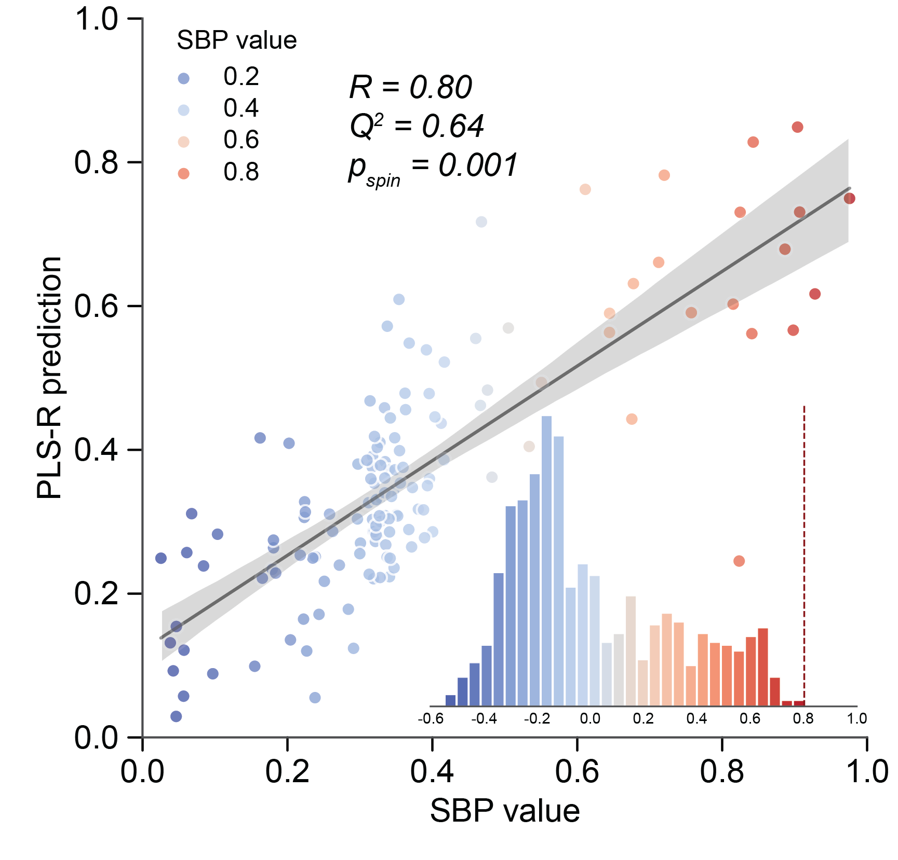

.. _usage_imt:

Imaging-transcriptomics
=======================

.. _usage_class:

Construct main class of ``zoom``
--------------------------------

After preparing the required data, we construct ``ZOOM_SC``, the main object used in ``zoom`` class, 
using the following code:

.. code-block:: python
    
    >>> from core import ZOOM_SC
    >>> zoom_obj = ZOOM_SC(
            adata=adata,
            expression=hcp_expr, 
            SBP=SBP, 
            SBP_perm=SBP_perm,
            best_comp=None,
            cv=10
        )

Notably, if you only wish to explore the conventional imaging–transcriptomics paradigm and do not 
intend to extend to scRNA-seq dataset, you construct a ``ZOOM`` object, in which case providing an 
additional ``adata`` is unnecessary:

.. code-block:: python
    
    >>> from core import ZOOM
    >>> zoom_obj = ZOOM(
            expression=hcp_expr, 
            SBP=SBP, 
            SBP_perm=SBP_perm,
            best_comp=None,
            cv=10
        )

.. note:: 
    For all analyses on this page, both the ``ZOOM`` object and the ``ZOOM_SC`` object are equally 
    applicable. However, if you intend to perform downstream single‑cell analyses, be sure to 
    construct a ``ZOOM_SC`` object and prepare the ``adata``.

Arguments to :func:`zoom.core.ZOOM` and :func:`zoom.core.ZOOM_SC`
+++++++++++++++++++++++++++++++++++++++++++++++++++++++++++++++++

.. class:: best_comp int, default None

  Optimal number of PLS-R components. If None, ``zoom`` will determine it via cross-validation.

.. class:: cv int, default 10
  
  Number of cross-validation folds.

.. _usage_plsr:

Partial least squares regression
--------------------------------

Partial least squares regression (PLS‑R) model is widely used to associate SBPs with AHBA gene 
expression profile. ``zoom`` adopts the `cross‑validation approach used by Wang, Y. et. al. 
<https://doi.org/10.1016/j.celrep.2024.113770>`_ to determine the optimal component number for 
PLS-R model. Further, ``zoom`` evaluate how well weighted gene combinations predict SBPs, and 
assess whether predictive performance reflects genuine biological underpinnings or spatial 
autocorrelation utilizing permutated SBPs. The PLS‑R analysis can be implemented with the 
following code and we can print Pearson's correlation between observed and predicted SBP, 
:math:`Q^2` (cross-validation :math:`R^2`) and :math:`p_perm`:

.. code-block:: python
    
    >>> zoom_obj.cv_PLSR(
            ncomps=range(1,16),
            repeats_cv=30,
            repeats_pred=101
        )
    >>> print(zoom_obj.PLS_r, zoom_obj.PLS_Q2, zoom_obj.PLS_p_perm)
    0.8020500907513676  0.6419170826488139  0.001

   Dot plot of SBP value and PLS-R prediction, with empirical null distribution of Pearson's 
   correlation between SBP value and PLS-R predictions trained on permutated SBPs shown on embedded 
   histogram.

.. note:: 
    Note that the obtained optimal number of component is available as ``zoom_obj.best_comp``. Within 
    a given range, the PLS‑R model’s predictive performance on the test set typically improves with 
    increasing component number up to a point (underfitting) and then declines (overfitting). Therefore, 
    if ``zoom_obj.best_comp`` equals 15 in the above procedure, this does not necessarily indicate a 
    global optimum. You may search over a wider range by re-setting ``ncomps``. Testing more candidate 
    values increases computation time, which can be mitigated by using a smaller ``repeats_cv``.

Arguments to class method :func:`ZOOM_SC.cv_PLSR`
+++++++++++++++++++++++++++++++++++++++++++++++++

.. class:: ncomps {list, numpy.ndarray} optional, default range(1,16)

  Optimal component number candidates. ``zoom`` will pick optimal component number among these candidates.

.. class:: repeats_cv int, default 30
  
  How many times should optimal component evaluation be run?

.. class:: repeats_pred int, default 101
  
  How many times should model performance evaluation be run? The final performance is defined as the 
  median Pearson's correlation among ``repeats_pred`` times repeats.

After running the above class method, the PLS‑R results are stored as the attribute can of ``ZOOM_SC``.

.. class:: PLS_r float

  Median Pearson's correlation between predicted SBP value and observed SBP value.

.. class:: PLS_Q2 float
  
  Median predictive accuracy of PLS-R model.

.. class:: PLS_p_perm float
  
  P-value of spatial permutation test, defined as the proportion of null distribution that exceeded the 
  real model performance.

.. _usage_gene:

Gene contribution statistics
----------------------------

Next, we aim to quantify each gene's contribution in predicting SBPs using the AHBA dataset. ``zoom`` 
provides three PLS statistics, namely variable importance in PLS prejection (VIP), regression coefficient 
(RC), and noemalized PLS1 weight (PLS1). VIP serves as an example here. ``zoom`` also simultaneously 
evaluates whether gene contributions represent spatial‑autocorrelation‑driven false positives by comparing 
to permuted SBPs:

.. code-block:: python
    
    >>> zoom_obj.get_gene_contrib(metric="VIP")
    >>> zoom_obj.PLS_report
                Weight  Sign  p_perm
    gene        
    A1BG      0.746265    -1   0.339
    A1BG-AS1  1.040469    -1   0.244
    AAAS      0.935083    -1   0.145
    AAED1     0.790452     1   0.070
    ...            ...   ...     ...
    ZYX       0.625381    -1   0.414
    ZZEF1     0.803275    -1   0.240
    ZZZ3      0.843117    -1   0.195
    [7773 rows x  3 columns]

Here, a positive ``Sign`` indicates the gene points in the positive direction of the given SBP, and 
a negative Sign indicates the opposite. ``Weight`` denotes the gene’s contribution to the PLS‑R prediction, 
and ``p_perm`` is the gene‑level p‑value from the spatial permutation test. Since VIP is unsigned, the ``Sign`` 
reported for VIP is taken from RC.

.. note:: 
    You may notice that the number of genes in ``zoom_obj.PLS_report`` (7773) does not match the original 
    AHBA dataset (7973). This is because when constructing a ``ZOOM_SC`` object, ``zoom`` automatically 
    filters the genes in ``adata`` and the AHBA dataset, retaining only their intersection.

Arguments to class method :func:`ZOOM_SC.get_gene_contrib`
++++++++++++++++++++++++++++++++++++++++++++++++++++++++++

.. class:: metric str, default "VIP"

  The statistical metric used to quantify gene contribution to PLS-R prediction. Must be one of {"PLS1", 
  "RC", "VIP"}.
  - PLS1: Normalized PLS1 weights estimated through bootstrap strategy, please also specify ``n_boot=1000`` 
    if you use PLS1.
  - RC: Regression coefficient.
  - VIP: Variable importance in projection.

.. _usage_size:

Pick optimally sized gene set
-----------------------------

Before performing single‑cell scoring, we must verify whether the variables (genes) highlighted by the gene 
contribution statistics are biologically meaningful and determine the gene set size for downstream analysis. 
To do this, ``zoom`` first sorts ``zoom_obj.PLS_report`` by ``p_perm`` ascending (ties broken by ``Weight`` 
descending), then selects the top ``n`` genes separately from the positively signed genes and negatively 
signed genes to form a gene set, constructs an AHBA subset from this gene set to predict the SBP, and finally 
assesses predictive accuracy using :math:`Q^2`. You can quickly do it with following code:

.. code-block:: python
    
    >>> Q2_stats = zoom_obj.test_gene_size(gene_sizes=[30,40,50,75,100,150,200,250,300,400,500])
    >>> Q2_stats
                     Q2
    gene size  
    30         0.769825
    40         0.822449
    50         0.837205
    ...             ...
    300        0.883933
    400        0.861235
    500        0.857694
    [11 rows x  1 columns]

Selecting the top 40 highlighted genes from both directions respectively already yields PLS‑R predictive accuracy 
far exceeding that obtained using all genes. Further increasing the gene size does not significantly improve 
predictive accuracy. Thus, 40 genes capture the vast majority of the information needed to describe one 
direction of the given SBP, and adding more genes primarily introduces noise.

Arguments to class method :func:`ZOOM_SC.test_gene_size`
++++++++++++++++++++++++++++++++++++++++++++++++++++++++++

.. class:: gene_sizes list

  List of candidate gene set sizes.

.. _usage_gsea:

Spatial permutation-based GSEA
------------------------------

If you wish to further test which biological pathways are more associated with a given SBP, ``zoom`` also 
provides a spatial permutation–based GSEA. Conventional GSEA permutes the gene ranking to generate a 
null distribution, whereas the spatial permutation–based GSEA derives control gene rankings from permuted 
SBPs. Here we use the ``GO: Biological Process(2025)`` downloaded from `enrichR <https://maayanlab.cloud/
Enrichr/#libraries>`_ as an example:

.. note:: 
    Because VIP and RC reflect each gene’s overall contribution across all PLS components, their gene 
    rankings represent weighted combinations of multiple pathways and are therefore unsuitable for 
    simple pathway enrichment under a GSEA framework. We therefore recommend using PLS1 as the 
    gene‑contribution metric for simple pathway analysis, as in the example below. However, for 
    gene sets that inherently combine multiple pathways, such as gene co‑expression modules, using 
    RC or VIP rankings is plausible and recommended since PLS1 always fails to capture meaningful 
    biological underpinnings when the first component does not explain the majority of total variance 
    of given SBP.

.. code-block:: python
    
    >>> from gseapy import read_gmt
    >>> BP = read_gmt("/path/to/GO_Biological_Process_2025.gmt")
    >>> gsea_res = zoom_obj.GSEA(
            gene_sets=BP,
            min_size=50,
            max_size=500
        )
    >>> gsea_res
                                                                 ES        NES  p_perm  p_perm_fdr
    Term
    Cation Binding (GO:0043169)                            -0.59988  -1.537195   0.000       0.000
    Protein Serine/Threonine Kinase Activity (GO:0004674)  0.343912   1.380443   0.004       0.216
    ...                                                         ...        ...     ...         ...

Arguments to class method :func:`ZOOM_SC.GSEA`
++++++++++++++++++++++++++++++++++++++++++++++++++++++++++

.. class:: gene_sets dict

  Gene sets for enrichment analysis, must be organized as {'Term1': [Gene1, Gene2,...],...}, or a dict of 
  the above gene sets, with keys indicating the name of dataset.

.. class:: min_size int, default 50

  Minimum size of target gene set to be included in GSEA analysis

.. class:: max_size int, default 500

  Maximum size of target gene set to be included in GSEA analysis